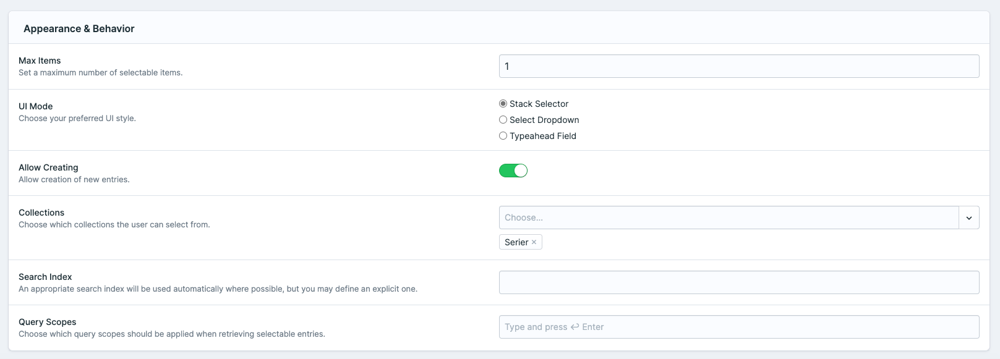
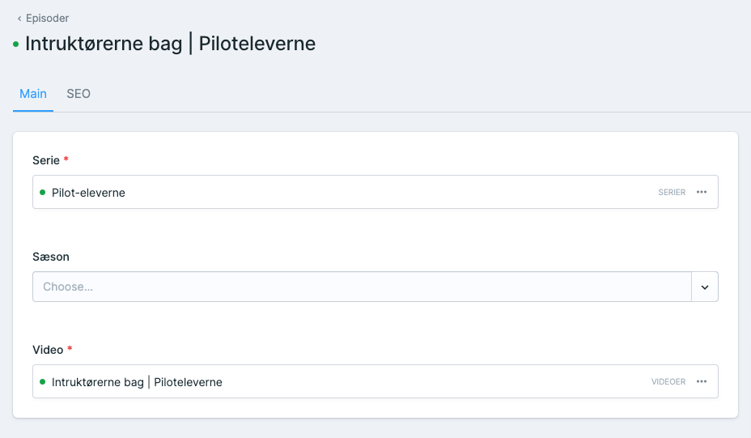
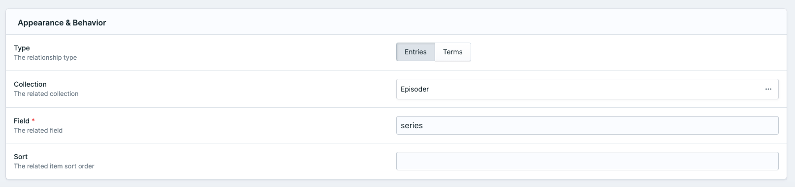
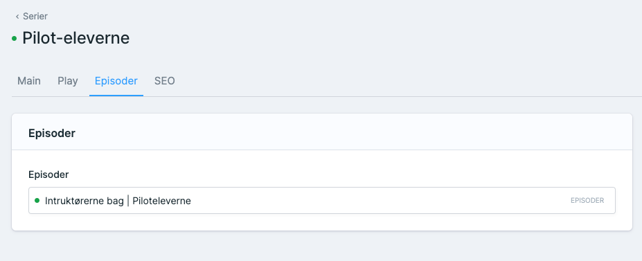

# Reverse Relationship Addon for Statamic

## Overview
Reverse Relationship is an innovative Statamic addon that simplifies the management of one-to-many and many-to-one relationships in your Statamic projects. 

This package eliminates the need to create and sync a relationship column in both collections, ensuring a more streamlined and efficient workflow.

## Key Features

- **Effortless Relationship Management:** Easily set up one-to-many and many-to-one relationships without the need for duplicating relationship columns in both collections.
- **Antlers Template Support:** Utilize the field in Antlers templates to fetch related entries with minimal effort.
- **Configurable Fieldtype:** Customizable settings for selecting related collections or taxonomies, defining the relationship field, and sorting the displayed entries.
- **Automated Data Synchronization:** Keeps your relationship data consistent and synchronized automatically.

## Installation

1. Install the addon via Composer:
```bash
composer require tv2regionerne/statamic-reverse-relationship
```

## Configuration and Usage

### Setting up Relationships
**One-to-Many Relationship:**
- In the 'many' side collection's blueprint (e.g., Episodes), create an 'Entries' fieldtype (e.g., series) with a maximum of one entry, pointing to the 'one' side collection (e.g., Series).

**Many-to-One Relationship:**
- In the 'one' side collection's blueprint (e.g., Series), add the Reverse Relationship fieldtype with a configuration pointing to the 'many' side collection (e.g., Episodes) and the specific relationship field (e.g., series).

### Example: Series and Episodes
**Episodes Collection Blueprint:**  
Add an 'Entries' fieldtype named 'series', limited to 1 entry, linked to the Series collection.



**Series Collection Blueprint:**  
Add a Reverse Relationship fieldtype named 'Episodes', configured to the Episodes collection and the 'series' field.



### In Templates
Fetch related entries in Antlers templates using the Reverse Relationship field:
```antlers
{{  collection:series }}
    {{  title }}<br>
    <ul>
        {{ episodes scope="episode" }}
            <li>{{ episode:title }}</li>
        {{ /episodes }}
    </ul>
{{  /collection:series }}
```

## Limitations
The addon does not support many-to-many relationships.  
Correct setup of relationship fields in collections or taxonomies is crucial for proper functionality.

## Support
For queries, issues, or requests, visit our GitHub issues page.  
https://github.com/tv2regionerne/statamic-reverse-relationship/issues
